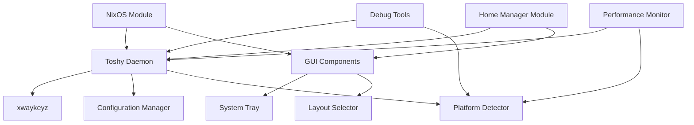

# Toshy Developer Guide

This guide covers development, testing, and contribution workflows for the Toshy project.

## Table of Contents

1. [Development Setup](#development-setup)
2. [Architecture Overview](#architecture-overview)
3. [Building and Testing](#building-and-testing)
4. [Contributing](#contributing)
5. [Release Process](#release-process)

## Development Setup

### Prerequisites

- Nix with flakes enabled
- Git
- Basic understanding of Python and Nix

### Getting Started

1. **Clone the repository**:
   ```bash
   git clone https://github.com/celesrenata/toshy.git
   cd toshy
   ```

2. **Enter development environment**:
   ```bash
   nix develop
   ```

3. **Verify setup**:
   ```bash
   # Check available tools
   pytest --version
   black --version
   flake8 --version
   
   # Run tests
   pytest tests/
   ```

### Development Environment

The development shell provides:

- **Python 3.13** with all dependencies
- **Testing tools**: pytest, pytest-cov, pytest-mock
- **Code quality**: black, flake8, mypy
- **Build tools**: setuptools, wheel, pip
- **System dependencies**: GTK3, GObject introspection
- **Platform tools**: toshy-platform, toshy-debug, toshy-performance

### IDE Setup

#### VS Code

Recommended extensions:
- Python
- Nix IDE
- GitLens
- Test Explorer UI

Configuration (`.vscode/settings.json`):
```json
{
  "python.defaultInterpreterPath": "./result/bin/python",
  "python.testing.pytestEnabled": true,
  "python.testing.pytestArgs": ["tests/"],
  "python.formatting.provider": "black",
  "python.linting.flake8Enabled": true
}
```

#### Vim/Neovim

Use `direnv` for automatic environment loading:
```bash
echo "use flake" > .envrc
direnv allow
```

## Architecture Overview

### Project Structure

```
toshy/
├── flake.nix                    # Nix flake definition
├── pyproject.toml              # Python project configuration
├── toshy/                      # Main Python package
│   ├── __init__.py
│   ├── daemon.py               # Main daemon
│   ├── config.py               # Configuration management
│   ├── config_generator.py     # Configuration generation
│   ├── platform_utils.py       # Platform detection
│   ├── debug_utils.py          # Debugging tools
│   ├── performance_utils.py    # Performance monitoring
│   ├── tray.py                 # System tray
│   ├── layout_selector.py      # GUI components
│   └── common/                 # Shared utilities
├── modules/                    # NixOS modules
│   └── toshy.nix              # Main NixOS module
├── home-manager/              # Home Manager modules
│   └── toshy.nix              # Home Manager module
├── tests/                     # Test suite
├── examples/                  # Configuration examples
└── docs/                      # Documentation
```

### Component Architecture



### Key Components

#### 1. Daemon (`toshy/daemon.py`)
- Main service process
- Manages xwaykeyz lifecycle
- Handles platform detection
- Provides graceful shutdown

#### 2. Configuration System
- **Generator** (`config_generator.py`): Creates xwaykeyz configs from NixOS options
- **Manager** (`config.py`): Validates and manages configuration files
- **NixOS Module** (`modules/toshy.nix`): Declarative system configuration

#### 3. Platform Support (`platform_utils.py`)
- Architecture detection (x86_64, aarch64, ARM)
- Display server detection (X11, Wayland)
- Desktop environment detection
- Performance recommendations

#### 4. Diagnostic Tools
- **Debug utility** (`debug_utils.py`): System diagnostics
- **Performance monitor** (`performance_utils.py`): Resource monitoring
- **Platform detector**: Hardware/software detection

### Data Flow

1. **Configuration**: NixOS options → Configuration generator → xwaykeyz config
2. **Runtime**: Daemon → Platform detection → xwaykeyz startup → Key processing
3. **Monitoring**: Performance monitor → System metrics → Optimization recommendations

## Building and Testing

### Building

```bash
# Build main package
nix build .#toshy

# Build for specific platform
nix build .#packages.aarch64-linux.toshy

# Build all outputs
nix build .#packages.x86_64-linux.default
```

### Testing

#### Unit Tests

```bash
# Run all tests
pytest tests/

# Run specific test file
pytest tests/test_config.py

# Run with coverage
pytest --cov=toshy tests/

# Run with verbose output
pytest tests/ -v
```

#### Integration Tests

```bash
# Test NixOS module
pytest tests/test_nixos_integration.py

# Test platform detection
pytest tests/test_phase4_features.py::TestPlatformDetection
```

#### Manual Testing

```bash
# Test platform detection
toshy-platform

# Test configuration validation
toshy-config --validate

# Test daemon startup
toshy-daemon --help

# Run diagnostics
toshy-debug
```

### Code Quality

#### Formatting

```bash
# Format code
black toshy/ tests/

# Check formatting
black --check toshy/ tests/
```

#### Linting

```bash
# Lint code
flake8 toshy/ tests/

# Type checking
mypy toshy/
```

#### Pre-commit Hooks

Set up pre-commit hooks:
```bash
# Install pre-commit
pip install pre-commit

# Install hooks
pre-commit install

# Run manually
pre-commit run --all-files
```

### Performance Testing

```bash
# Basic performance test
toshy-performance --benchmark 60

# Startup time measurement
toshy-performance --startup-time

# Save detailed results
toshy-performance --benchmark 300 --json --output perf-results.json
```

## Contributing

### Contribution Workflow

1. **Fork the repository**
2. **Create a feature branch**:
   ```bash
   git checkout -b feature/my-new-feature
   ```
3. **Make changes and test**:
   ```bash
   # Make your changes
   # Run tests
   pytest tests/
   # Format code
   black toshy/ tests/
   ```
4. **Commit with clear messages**:
   ```bash
   git commit -m "feat: add new keybinding feature"
   ```
5. **Push and create PR**

### Commit Message Format

Use conventional commits:
- `feat:` New features
- `fix:` Bug fixes
- `docs:` Documentation changes
- `test:` Test additions/changes
- `refactor:` Code refactoring
- `perf:` Performance improvements
- `chore:` Maintenance tasks

### Code Standards

#### Python Code Style
- Follow PEP 8
- Use Black for formatting
- Maximum line length: 88 characters
- Use type hints where appropriate
- Document functions with docstrings

#### Nix Code Style
- Use nixpkgs-fmt for formatting
- Follow nixpkgs conventions
- Use meaningful variable names
- Add comments for complex logic

#### Testing Standards
- Aim for >80% test coverage
- Write unit tests for all new functions
- Add integration tests for major features
- Use descriptive test names
- Mock external dependencies

### Adding New Features

#### 1. Platform Support

To add support for a new platform:

1. **Update platform detection**:
   ```python
   # In platform_utils.py
   def detect_new_platform(self):
       # Add detection logic
       pass
   ```

2. **Add platform-specific optimizations**:
   ```python
   def get_optimization_flags(self):
       if self.is_new_platform:
           return ['-O2', '-march=new-arch']
   ```

3. **Update flake configuration**:
   ```nix
   # In flake.nix
   platformConfig = {
     new-platform = {
       enableOptimizations = true;
       supportedCompositors = ["compositor1"];
     };
   };
   ```

4. **Add tests**:
   ```python
   def test_new_platform_detection(self):
       # Test platform detection
       pass
   ```

#### 2. Configuration Options

To add new NixOS module options:

1. **Define option in module**:
   ```nix
   # In modules/toshy.nix
   newFeature = {
     enable = mkEnableOption "new feature";
     setting = mkOption {
       type = types.str;
       default = "default-value";
       description = "New feature setting";
     };
   };
   ```

2. **Implement in configuration generator**:
   ```python
   # In config_generator.py
   def generate_new_feature_config(self, options):
       if options.get('newFeature', {}).get('enable'):
           return "# New feature configuration"
   ```

3. **Add to service configuration**:
   ```nix
   # In modules/toshy.nix config section
   environment.NEW_FEATURE_ENABLED = mkIf cfg.newFeature.enable "1";
   ```

4. **Update tests and documentation**

#### 3. Diagnostic Tools

To add new diagnostic capabilities:

1. **Add check function**:
   ```python
   # In debug_utils.py
   def check_new_component(self):
       # Implement check logic
       return {
           'status': True,
           'details': 'Component working'
       }
   ```

2. **Integrate with comprehensive check**:
   ```python
   def run_comprehensive_check(self):
       results['new_component'] = self.check_new_component()
   ```

3. **Add to report generation**:
   ```python
   def print_diagnostic_report(self, results):
       # Add new component to report
   ```

### Documentation

#### Code Documentation
- Use docstrings for all public functions
- Include parameter and return type information
- Provide usage examples for complex functions

#### User Documentation
- Update user guide for new features
- Add configuration examples
- Include troubleshooting information

#### Developer Documentation
- Update architecture diagrams
- Document new APIs
- Add development workflow changes

## Release Process

### Version Management

Toshy uses semantic versioning (SemVer):
- **Major** (X.0.0): Breaking changes
- **Minor** (0.X.0): New features, backward compatible
- **Patch** (0.0.X): Bug fixes, backward compatible

### Release Checklist

1. **Pre-release Testing**:
   ```bash
   # Run full test suite
   pytest tests/
   
   # Test on multiple platforms
   nix build .#packages.x86_64-linux.toshy
   nix build .#packages.aarch64-linux.toshy
   
   # Run integration tests
   nix flake check --all-systems
   ```

2. **Update Version**:
   ```bash
   # Update pyproject.toml
   version = "X.Y.Z"
   
   # Update flake.nix if needed
   # Update documentation
   ```

3. **Generate Changelog**:
   - Document new features
   - List bug fixes
   - Note breaking changes
   - Include migration guide if needed

4. **Create Release**:
   ```bash
   git tag -a vX.Y.Z -m "Release X.Y.Z"
   git push origin vX.Y.Z
   ```

5. **Post-release**:
   - Update documentation
   - Announce release
   - Monitor for issues

### Continuous Integration

The project uses GitHub Actions for:
- **Testing**: Run test suite on multiple platforms
- **Building**: Verify builds on all supported architectures
- **Code Quality**: Check formatting and linting
- **Documentation**: Build and deploy documentation

### Deployment

#### NixOS Packages
- Submit to nixpkgs when stable
- Maintain flake for latest development

#### Documentation
- Deploy to GitHub Pages
- Update examples and guides

## Debugging and Troubleshooting

### Common Development Issues

#### 1. Build Failures

```bash
# Check flake syntax
nix flake check

# Build with verbose output
nix build .#toshy --verbose

# Check dependencies
nix develop --command python -c "import toshy"
```

#### 2. Test Failures

```bash
# Run specific failing test
pytest tests/test_specific.py::test_function -v

# Run with debugging
pytest tests/ --pdb

# Check test coverage
pytest --cov=toshy --cov-report=html tests/
```

#### 3. Platform Issues

```bash
# Check platform detection
toshy-platform

# Run diagnostics
toshy-debug

# Test cross-compilation
nix build .#packages.aarch64-linux.toshy
```

### Development Tools

#### Profiling

```bash
# Profile performance
python -m cProfile -o profile.stats toshy/daemon.py

# Analyze profile
python -c "import pstats; pstats.Stats('profile.stats').sort_stats('cumulative').print_stats(10)"
```

#### Memory Analysis

```bash
# Monitor memory usage
toshy-performance --benchmark 60

# Use memory profiler
pip install memory-profiler
python -m memory_profiler toshy/daemon.py
```

#### Debugging

```bash
# Run with debugging
python -m pdb toshy/daemon.py

# Use logging
TOSHY_LOG_LEVEL=DEBUG toshy-daemon
```

---

*This developer guide provides comprehensive information for contributing to Toshy. For user-focused information, see the [User Guide](USER_GUIDE.md).*
